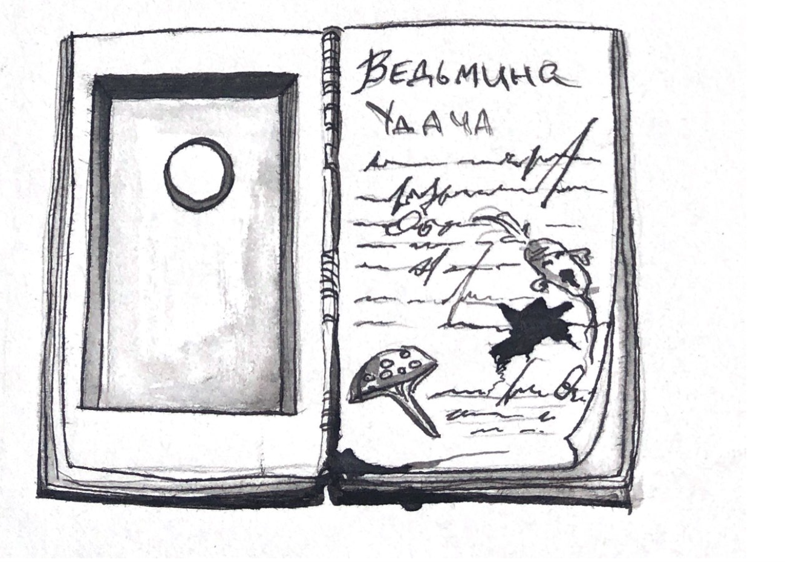
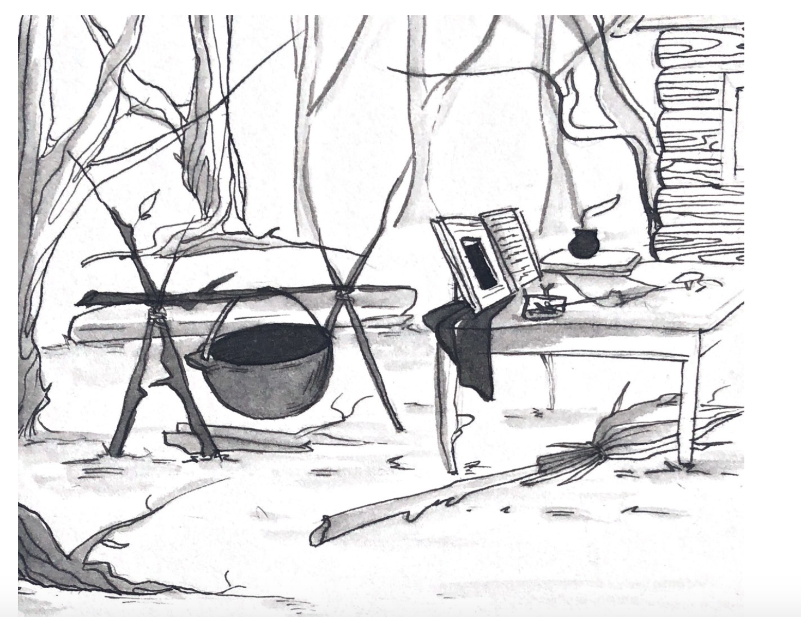

# Alchemy
Application developed during 3-day hackathon "CraftHack" by Croc

Alchemy is Android Augmented Reality app. Alchemy is created to improve roleplayers' and cosplayers' experience during games/plays. They can make potions with app. Alchemy keep magic ✨ 

Alchemy is also easy to biult in any enviroment (from steampunk to fairy tale) and use in various locations.
(see demo and inviroment prototypes)

## Developers
[Blue1Sun](https://github.com/Blue1Sun) 
[MariaPushkin](https://github.com/MariaPushkin) 
[moiraxavier](https://github.com/moiraxavier)

## Demo

## Inviroment prototypes 
| Place for phone          |  Eviroment               |
:-------------------------:|:-------------------------:
      | 
